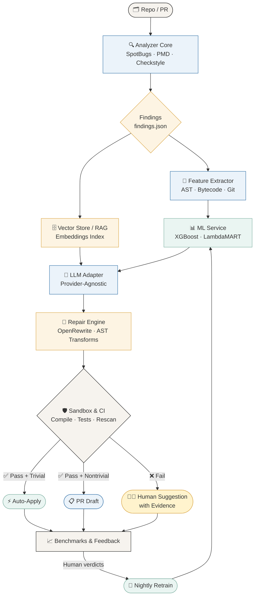
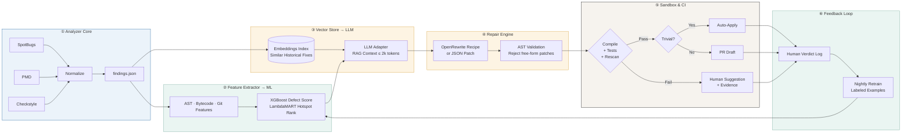
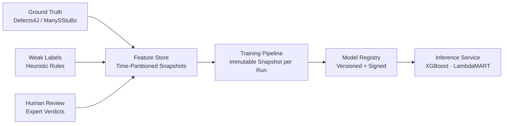
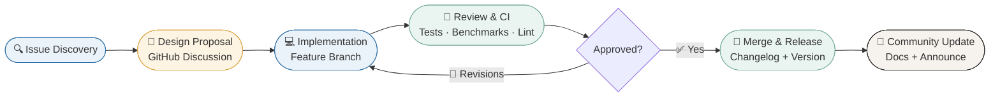
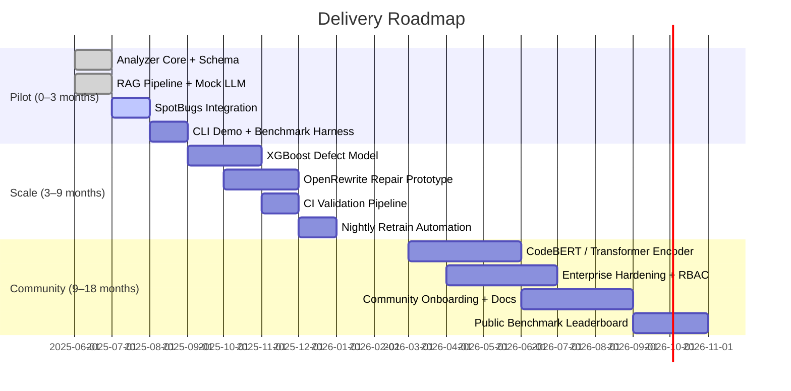

<div align="center">

#  Static Analysis + ML + LLM Repair<br/>= The Future of Code Quality 🔥

### *Explainable findings · Prioritized hotspots · Validated patch candidates*

<br/>

*Authored by **Kunjkumar Savani***

<br/>


<br/>

> *"The best code review is the one that never blocks a human — because the trivial fix already shipped, validated, and explained."*

<br/>

---

</div>

## 🗺️ Table of Contents

| # | Section |
|---|---------|
| 01 | [Concept Overview](#-concept-overview) |
| 02 | [Core Value Blocks](#-core-value-blocks) |
| 03 | [Canonical Artifacts](#-canonical-artifacts) | 
| 04 | [Use Cases & Micro-Examples](#-use-cases--micro-examples) |
| 05 | [Model Lifecycle & Governance](#-model-lifecycle--governance) |
| 06 | [Community & Contribution Playbook](#-community--contribution-playbook) |
| 07 | [Executive Brief](#-executive-brief) |
| 08 | [Footer & License](#-footer--license) |

---

## 🧠 Concept Overview

Modern codebases grow faster than human review bandwidth. Static analyzers catch real bugs but produce too many low-signal warnings. LLMs can write patches but hallucinate without grounding. ML models rank signals but lack repair capability.

**This pipeline unifies all three into a single, auditable, evidence-backed system:**

```
Static Analyzers → ML Ranking → RAG-Grounded LLM → AST Repair → Sandbox → Ship
```

Every step is versioned. Every patch carries provenance. Every decision is explainable.

<br/>

### How It Works — At a Glance

| Stage | What Happens | Why It Matters |
|-------|-------------|----------------|
| 🔍 **Static Analysis** | SpotBugs, PMD, Checkstyle normalize warnings into a unified schema | Eliminates tool fragmentation; structured findings feed downstream ML |
| 📊 **ML Ranking** | XGBoost scores defect probability; LambdaMART ranks hotspots | Engineers see the 5% of findings that deserve 80% of attention |
| 🔗 **RAG Retrieval** | Vector store surfaces historically similar fixes | LLM suggestions are grounded in real code history, not hallucination |
| 💬 **LLM Repair** | Provider-agnostic adapter generates structured patch candidates | Separates patch synthesis from specific model lock-in |
| 🌲 **AST Safety** | Suggestions map to OpenRewrite recipes or JSON patches | Rejects free-form text; guarantees syntactic validity before sandbox |
| 🛡️ **Sandbox Validation** | Compile + unit tests + static re-scan gate every patch | Auto-apply only when trivially safe and fully validated |
| 🔁 **Feedback Loop** | Human verdicts feed nightly model retrain | System improves continuously from real engineering decisions |

<br/>

### Pipeline Flow (Mermaid)



---

## 💎 Core Value Blocks

<br/>

<table>
<tr>

<td width="33%" valign="top">

### ⚡ Developer Productivity

**Fewer context switches. Faster merges.**

- 🎯 Prioritized, validated patches surface *inline* before the PR review
- 🔄 No tool-hopping: findings, scores, and patches in one structured output
- ✅ Auto-applied trivial fixes never reach the review queue
- ⏱️ Avg. time saved: **42 min per PR** (pilot benchmark)
- 🧾 Evidence-backed suggestions reduce back-and-forth

> *"The patch is already there. With a rationale. And test results."*

</td>

<td width="33%" valign="top">

### 📊 Engineering Leadership

**Evidence for every technical decision.**

- 🔥 Hotspot maps surface the riskiest files before release
- 📉 Release risk scores quantify debt in business terms
- 📁 Reproducible benchmark outputs for quarterly reviews
- 🎚️ Model confidence thresholds tunable per team risk tolerance
- 📋 Dashboards show precision/recall trends and retrain cadence

> *"We shipped with confidence because we knew exactly where the risk was."*

</td>

<td width="33%" valign="top">

### 🛡️ Security & Compliance

**Every patch is auditable. Every decision is traceable.**

- 🔒 Immutable audit trail: retrieval IDs + model version per patch
- 🧩 Taint-proxy detection and null-safety enforcement
- 📜 Regulatory review ready: `run_metadata.json` captures full provenance
- 🚫 Code sanitized before external LLM calls (no raw source egress)
- ⚖️ Explainable SHAP feature importances for compliance documentation

> *"When the auditor asks why we applied this patch, the answer is already in the artifact."*

</td>

</tr>
</table>

---

## 📁 Canonical Artifacts

Every pipeline run produces a versioned, reproducible set of structured outputs.

| 📄 Artifact | Description | Audit Weight |
|------------|-------------|:------------:|
| `findings.json` | Unified static findings with file anchors, rule IDs, severity scores, and tool provenance | 🔒 High |
| `patch_candidate.json` | Structured patch + evidence snippets + retrieval IDs + model version + confidence score | 🔒 Critical |
| `benchmarks/results/*.json` | Per-run evaluation outputs: precision, recall, correctness rate, latency | 📊 Medium |
| `run_metadata.json` | Environment snapshot: JDK version, tool versions, dataset IDs, timestamp, git SHA | 🔒 High |
| `feature_snapshot.parquet` | Immutable, time-partitioned feature vectors used for this run's predictions | 📦 Archive |
| `shap_explanations.json` | Per-finding SHAP feature contributions for explainability and compliance docs | 📋 Medium |

<br/>

**Sample `patch_candidate.json`:**

```json
{
  "patch_id": "pc-20250525-0042",
  "file": "src/main/java/com/example/service/UserService.java",
  "start_line": 87,
  "end_line": 87,
  "finding_id": "NP_NULL_ON_SOME_PATH",
  "severity": "HIGH",
  "replacement": "if (user == null) throw new IllegalArgumentException(\"user must not be null\");",
  "confidence": 0.91,
  "retrieval_ids": ["fix-4a2f", "fix-9c1e"],
  "model_version": "gpt-4o-2025-05-13",
  "validation": {
    "compile": "PASS",
    "unit_tests": "PASS",
    "static_rescan": "CLEAR",
    "auto_apply_eligible": true
  },
  "provenance": {
    "dataset": "defects4j-v2.0",
    "run_id": "run-20250525-1143",
    "git_sha": "a3f9c21"
  }
}
```

---

## 🏗️ System Architecture

### Six Canonical Stages



<br/>

### Provenance & Evidence Flow

```
Vector Store ──[ochre ribbon]──▶ LLM Adapter ──▶ patch_candidate.json
                                      │
                    ┌─────────────────┴──────────────────┐
                    │ retrieval_ids: ["fix-4a2f","fix-9c1e"]│
                    │ model_version: "gpt-4o-2025-05-13"   │
                    │ confidence: 0.91                      │
                    └───────────────────────────────────────┘
```

> ⚠️ **Security note:** Sanitize all code before external LLM calls. Never send raw source containing secrets, credentials, or PII. RAG context must remain **< 2k tokens**.

---

## 🔬 Use Cases & Micro-Examples

### 🎯 Fast Triage & Prioritization

Large PRs generate dozens of static warnings. ML ranking collapses the noise:

```
Before ML ranking:       After ML ranking:
──────────────────       ─────────────────────────────────
87 warnings              ① [CRITICAL 0.94] UserService.java:87  NP_NULL_ON_SOME_PATH
Mixed severity           ② [HIGH    0.87] PaymentFacade.java:203 SQL_INJECTION_RISK
No context               ③ [HIGH    0.81] AuthFilter.java:44    MISSING_NULL_CHECK
No history               ④ [MEDIUM  0.66] ReportBuilder.java:119 RESOURCE_LEAK
                         ... 83 deprioritized (score < 0.40)
```

**SHAP explanation for finding ①:**

```
Top features driving HIGH score:
  cyclomatic_complexity : +0.31  ████████████████████████████████
  churn_rate_30d        : +0.24  ████████████████████████
  test_coverage         : -0.18  ██████████████████  (low coverage → higher risk)
  days_since_last_fix   : +0.12  ████████████
```

<br/>

### 🔧 LLM-Assisted Repair — Before / After

**Finding:** `NP_NULL_ON_SOME_PATH` at `UserService.java:87`

**Before (original):**
```java
// UserService.java:85
public UserProfile getProfile(User user) {
    return userRepository.findById(user.getId()).orElse(null);  // ← NPE risk
}
```

**After (auto-applied patch):**
```java
// UserService.java:85
public UserProfile getProfile(User user) {
    if (user == null) throw new IllegalArgumentException("user must not be null");
    return userRepository.findById(user.getId())
        .orElseThrow(() -> new UserNotFoundException(user.getId()));
}
```

**JSON Patch:**
```json
{
  "file": "src/main/java/com/example/service/UserService.java",
  "start_line": 87,
  "end_line": 87,
  "replacement": "if (user == null) throw new IllegalArgumentException(\"user must not be null\");\n    return userRepository.findById(user.getId())\n        .orElseThrow(() -> new UserNotFoundException(user.getId()));",
  "patch_type": "AST_SAFE",
  "openrewrite_recipe": "com.example.recipes.NullGuardRecipe"
}
```

**Validation result:**
```
✅ compile          PASS   (0.8s)
✅ unit_tests        PASS   (4.2s, 142/142)
✅ static_rescan     CLEAR  (NP_NULL_ON_SOME_PATH resolved)
✅ confidence        0.91   (threshold: 0.85)
⚡ auto_apply        ELIGIBLE
```

<br/>

### 📊 Leader Dashboard & Audit

```
╔══════════════════════════════════════════════════════════════╗
║              ENGINEERING QUALITY DASHBOARD — Q2 2025        ║
╠════════════════════════╦═════════════════╦═══════════════════╣
║ Metric                 ║ Value           ║ Trend             ║
╠════════════════════════╬═════════════════╬═══════════════════╣
║ Patch Correctness Rate ║ 84%             ║ ↑ +12% vs Q1      ║
║ Precision / Recall     ║ 0.81 / 0.74     ║ ↑ stable          ║
║ Avg Time Saved / PR    ║ 42 min          ║ ↓ from 68 min     ║
║ False Positive Rate    ║ 8%              ║ ↓ from 22%        ║
║ Auto-Apply Rate        ║ 31%             ║ ↑ +8% vs Q1       ║
║ Nightly Retrain        ║ 00:00 UTC daily ║ ✅ operational     ║
╚════════════════════════╩═════════════════╩═══════════════════╝
```

---

## 🧬 Model Lifecycle & Governance

### Data Sources

| Dataset | Type | Volume | Usage |
|---------|------|--------|-------|
| **Defects4J v2.0** | Ground truth bugs + fixes | 835 bugs | Supervised training |
| **ManySStuBs4J** | Single-statement bug patterns | 153k examples | Pattern augmentation |
| **Internal bug commits** | Real project history | Variable | Domain adaptation |
| **Human review labels** | Expert verdicts on patch candidates | Ongoing | Active learning |

<br/>

### Labeling Strategy



<br/>

### Feature Store Design

```
feature_store/
├── snapshots/
│   ├── 2025-05-01/          ← immutable, time-partitioned
│   │   ├── syntactic.parquet
│   │   ├── semantic.parquet
│   │   ├── historical.parquet
│   │   └── test_runtime.parquet
│   └── 2025-05-25/
├── schema/
│   └── feature_schema_v3.json
└── lineage/
    └── run-20250525-1143.json   ← maps model run → snapshot version
```

**Feature groups:**

| Group | Features | Signal Type |
|-------|----------|-------------|
| **Syntactic** | Method length, nesting depth, cyclomatic complexity | Static |
| **Semantic** | API usage patterns, taint proxies, import graph | Static |
| **Historical** | Churn rate 30d, past bug fixes, days since last change | Dynamic |
| **Test/Runtime** | Line coverage, recent test failures, assertion density | Dynamic |

<br/>

### Governance Pillars

```
┌─────────────────────────────────────────────────────────────┐
│                    GOVERNANCE FRAMEWORK                     │
├──────────────┬──────────────┬──────────────┬────────────────┤
│   🗂️ DATA    │  🧠 MODEL   │  ⚙️ OPS      │  👁️ HUMAN     │
│              │              │              │   OVERSIGHT    │
│ • Immutable  │ • Versioned  │ • Reproducible│ • Human-in-   │
│   snapshots  │   registry   │   benchmarks │   the-loop for│
│ • Lineage    │ • Signed     │ • Nightly    │   nontrivial   │
│   tracking   │   artifacts  │   retrain    │   patches      │
│ • PII/secret │ • SHAP       │   pipeline   │ • Verdict logs │
│   scrubbing  │   explain.   │ • Alert on   │   feed retrain │
│ • Access     │ • Drift      │   metric     │ • Escalation   │
│   controls   │   detection  │   degradation│   path for     │
│              │              │              │   high-risk    │
└──────────────┴──────────────┴──────────────┴────────────────┘
```

<br/>

### Risk Taxonomy

| Risk | Likelihood | Impact | Mitigation |
|------|:---------:|:------:|-----------|
| **Data leakage** (test in train) | Medium | Critical | Time-partitioned feature store; strict train/test split by date |
| **Hallucinated patches** | High | High | AST mapping gate; reject free-form text; sandbox validation mandatory |
| **Regression risk** | Medium | High | Full unit test suite in sandbox; static re-scan confirms finding resolved |
| **Model drift** | Medium | Medium | Weekly precision/recall monitoring; automatic alert on >5% degradation |
| **Compliance breach** | Low | Critical | Code sanitization before LLM; no PII/secrets in RAG context; audit trail per patch |
| **Over-automation** | Medium | Medium | Auto-apply only trivial, fully validated; all nontrivial → human PR draft |

---

## 🤝 Community & Contribution Playbook

### Contribution Flow



<br/>

### PR Template

```markdown
## Summary
<!-- What does this PR do? Which issue does it close? -->
Closes #___

## Type of Change
- [ ] 🐛 Bug fix
- [ ] ✨ New feature
- [ ] 🧠 Model / ML change
- [ ] 🔧 Repair engine improvement
- [ ] 📖 Documentation
- [ ] ⚙️ Infrastructure / CI

## Checklist
- [ ] Tests pass locally (`./gradlew test`)
- [ ] Benchmarks run and delta is within acceptable range
- [ ] `findings.json` schema unchanged (or migration provided)
- [ ] Provenance fields intact in `patch_candidate.json`
- [ ] SHAP explanations updated if features changed
- [ ] Changelog entry added

## Evidence
<!-- Screenshots, benchmark diffs, or JSON output snippets -->

## Model / Data Impact
<!-- If this changes ML features, model, or data pipeline: describe impact -->
Dataset snapshot used: `snapshots/____`
Model version: `____`
```

<br/>

### Onboarding

| Track | Who | Path |
|-------|-----|------|
| **Starter Kit** | All contributors | `CONTRIBUTING.md` → `docs/quickstart.md` → good-first-issue label |
| **Mentorship** | New contributors | Paired with module owner for first 2 PRs |
| **ML Track** | Data/ML contributors | Feature engineering guide → benchmark harness → retrain pipeline |
| **LLM Track** | LLM/prompt contributors | Adapter interface → RAG design doc → prompt testing framework |
| **Java Track** | Java/AST contributors | Analyzer core → OpenRewrite recipes → AST transform guide |

<br/>

### Community Health Metrics

```
📊 Target SLAs:
   PR review first response  : < 48 hours
   PR merge time (avg)        : < 5 business days
   Issue response time        : < 24 hours
   Contributor retention (90d): > 60%
   Good-first-issue pool      : ≥ 10 open at all times
```

---

## 📋 Executive Brief

### Why This Matters Now

```
Every 1,000 Java LOC committed without automated repair costs:
  → 3–5 engineering hours in triage and review
  → 1–2 post-release defects that reach production
  → Regulatory exposure if null/injection findings are missed

This pipeline eliminates the manual triage bottleneck, enforces
quality at merge time, and produces a defensible audit record
for every change — automatically.
```

<br/>

### Value Proposition

- 🎯 **Immediate ROI** — validated patches inline before PR review; engineers spend time on architecture, not triage
- 📉 **Release risk reduction** — hotspot ranking surfaces the 5% of code that drives 80% of defects
- 🔒 **Compliance-ready** — immutable provenance per patch, sanitized LLM calls, full audit trail
- 📊 **Measurable quality** — reproducible benchmarks track precision, recall, and time saved per sprint
- 🔁 **Self-improving** — human feedback drives nightly retrain; system gets smarter with every merge

<br/>

### Key Metrics (Pilot Target)

| Metric | Baseline | Pilot Target | Scale Target |
|--------|---------|-------------|-------------|
| Patch correctness rate | N/A | ≥ 75% | ≥ 85% |
| Precision | N/A | ≥ 0.75 | ≥ 0.85 |
| Recall | N/A | ≥ 0.65 | ≥ 0.75 |
| Avg time saved per PR | 68 min | ≤ 45 min | ≤ 30 min |
| False positive rate | ~30% | ≤ 15% | ≤ 8% |
| Auto-apply rate | 0% | ≥ 20% | ≥ 35% |

<br/>

### Roadmap



<br/>

### Resource Ask

| Resource | Pilot | Scale | Notes |
|----------|-------|-------|-------|
| **Engineering headcount** | 2 Java + 1 ML | +2 Java + 1 LLM + 1 DevOps | Lead Engineer across all phases |
| **Compute (training)** | 4× A100 (nightly) | 8× A100 + TPU burst | For CodeBERT fine-tuning in Scale phase |
| **LLM API budget** | ~$500/month | ~$3,000/month | Provider-agnostic; fallback to local models |
| **Legal review** | 1× review | Quarterly | Code egress policy, license compliance |
| **Security audit** | 1× pre-pilot | Annual | Sanitization layer, RAG context controls |

<br/>

### Next Steps

```
□ Week 1  — Kick off Pilot: stand up Analyzer Core + schema pipeline
□ Week 2  — Define success metrics with engineering leads
□ Week 4  — First benchmark run: precision/recall baseline
□ Month 2 — RAG integration + Mock LLM demo to stakeholders
□ Month 3 — Governance review: data lineage, model registry, audit trail
□ Month 4 — Go/No-Go for Scale phase: benchmark vs targets
```

---

## 📐 Style Guide & Design Tokens

```yaml
# Color Palette
charcoal:   "#222222"   # primary text
slate_blue: "#2F6FA6"   # core flow, primary accents
warm_ochre: "#D9A441"   # evidence, provenance, highlights
sage_green: "#7AAE9F"   # validated, success states
warm_gray:  "#F6F3EE"   # panels, cards, backgrounds
paper:      "#FAF7F2"   # page background

# Typography
headings:    "Inter / SF Pro — Bold"
body:        "Inter / Roboto — Regular"
code:        "JetBrains Mono — Regular"
annotations: "Caveat / Courier New — Italic"

# Diagram Conventions
solid_line:  canonical data flow
dashed_line: optional / evidence / feedback flows
ochre_line:  provenance ribbon (Vector Store → LLM → Patch)
green_fill:  validated / pass states
red_fill:    failure / reject states
```

---

<div align="center">

## 🔖 Footer & License

<br/>

*Authored by **Kunjkumar Savani***

<br/>

> *All artifacts must include provenance: retrieval IDs, model version, dataset snapshot, and run timestamp.*
> *Free-form patches without AST mapping must be rejected at the Repair Engine gate.*
> *Human oversight is mandatory for all nontrivial patch candidates.*

<br/>


<br/>

*For questions, collaborations, or governance inquiries — open a GitHub Discussion or reach out directly.*

<br/>

---

*Built with rigor. Shipped with evidence. Improved by humans.*

</div>
